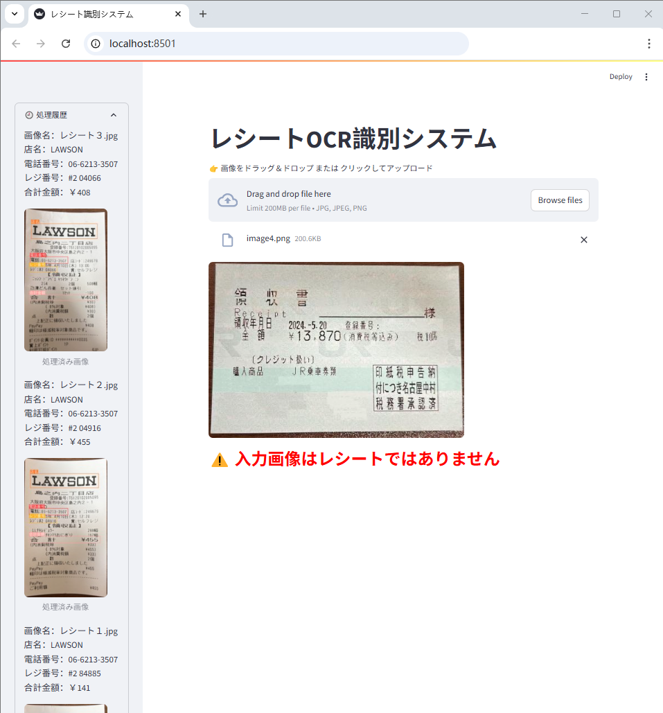

# レシートOCRシステム

---

## 1. プロジェクト概要

本プロジェクトは、入力された画像を認識し、そこから情報を抽出することを目的としたシステムです。  
まず、分類モデルを用いて画像がコンビニのレシートかどうかを判定します。レシートでない場合は、ユーザーにその旨を返します。  
画像がコンビニレシートであると判定された場合は、物体検出モデルによってレシート内の特定ラベルを認識・位置特定し、  
その領域に対してOCR（Optical Character Recognition）を適用して情報を抽出します。抽出された情報はテキストとして保存され、UI画面上に表示されます。  

本プロジェクトで使用している分類モデルおよび物体検出モデルは、それぞれ以下の通りです：  
- 分類モデルプロジェクト：[classification_model][classification_model]
- 物体検出モデルプロジェクト: [detect_model][detect_model]

---

### 結果の表示

以下の図は、本プロジェクトの結果の一例です。  
入力されたレシート画像から対象情報が抽出され、UI上に表示されます。  


---

## 2.プロジェクト構成

<pre>
.
├── OCR/                # OCR関連のコードを格納するフォルダ  
├── config/             # プロジェクト内の各種パラメータを定義したyamlファイル  
├── images/             # README用の画像ファイル  
├── logs/               # 学習済みの分類モデルおよび物体検出モデルを保存するフォルダ  
├── resnet/             # ResNet分類モデルに関するコード  
├── storage/detect/     # レシートから抽出した情報を保存するフォルダ  
├── utils/              # 実行や関数呼び出しに関連するユーティリティコード  
├── yolo10/             # YOLOv10物体検出モデル関連のコード  
├── requirements.txt    # Python依存関係  
├── app.py              # システム実行用スクリプト  
└── README.md           # プロジェクトの説明ドキュメント
</pre>

---

## 3. システムの実行説明

`app.py`を実行すると、[streamlit][streamlit]で構築されたUI画面が表示されます。  
このUIを通じて画像を入力すると、システムはまず`resnet/`内のResNet50分類モデルを用いて画像の種類を判定します。  
画像がコンビニのレシートでない場合は、ユーザーにその旨を通知します。  
レシートと判定された場合は、`yolo10/`内のYOLOv10物体検出アルゴリズムを使用し、レシート上の対象ラベルを認識・位置特定します。  
本プロジェクトでは、以下の4種類のラベルを対象としています：  
- **店名**
- **電話番号**
- **レジ番号**
- **合計金額**

下図のように、レシート上のこれら4つのラベルは正確に検出・位置特定されます。  


認識が完了すると、物体検出モデルはラベルとそれに対応する予測バウンディングボックス（切り出し画像）を出力します。  
その後、`OCR/`内のOCRモデルを用いて、各予測領域からテキスト情報を抽出します。  
本プロジェクトでは、OCRライブラリとして [PaddleOCR][PaddleOCR] を使用しています。  

---

## 4. 実行デモ

以下のコマンドをターミナルに入力すると、[streamlit][streamlit]で構築されたUI画面が起動します。  

```python
streamlit run app.py
```

実行後、ブラウザが自動的にローカルホストのポート `localhost:8501` を開きます。


UI画面上の「Browse files」ボタンをクリックするか、画像をドラッグ＆ドロップすることで、画像をアップロードすることができます。  
下図のように、コンビニのレシート画像がアップロードされると、画像名に加え、`店名`、`電話番号`、`レジ番号`、`合計金額`の4つのラベルに対応する情報が抽出され、画面上に表示されます。  
また、検出処理が行われたレシート画像も下部に表示されます。  


下図のように、認識されたレシート画像および関連情報は、UI画面の左側にある処理履歴に保存されます。  


下図のように、入力画像が分類モデルによって「コンビニのレシートではない」と判定された場合、  
UI画面にはその画像が表示されるとともに、「入力画像はレシートではありません」というメッセージが表示されます。  



認識処理が完了したレシート画像は`storage/detect/`に保存されるとともに、レシートから抽出されたテキスト情報は`result.csv`に記録されて保存されます。  


`storage/detect/`に保存されるファイル


`result.csv`に記録されている情報

---

## 5. 付録

- 分類モデル： [classification_model][classification_model]
- 物体検出モデル： [detect_model][detect_model]
- OCRライブラリ： [PaddleOCR][PaddleOCR]
- UI画面: [streamlit][streamlit]


[classification_model]: https://github.com/kakoubou/classification_model
[detect_model]: https://github.com/kakoubou/detect_model
[streamlit]: https://github.com/streamlit/streamlit
[PaddleOCR]: https://github.com/PaddlePaddle/PaddleOCR


